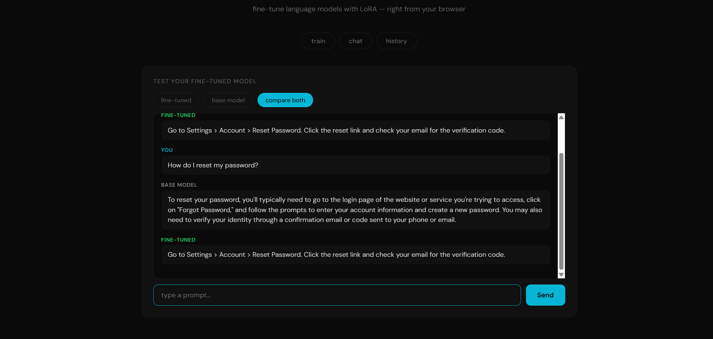
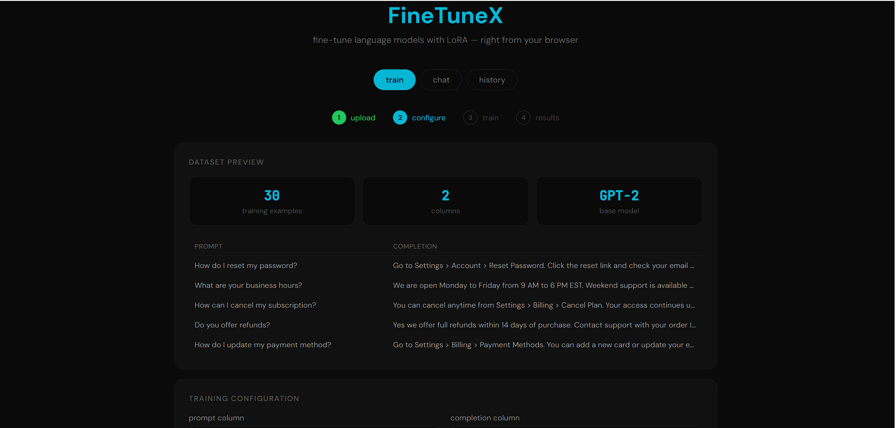

# FineTuneX

LLM fine-tuning platform that lets you upload custom training data, fine-tune GPT-2 using LoRA adapters, and test your model through a chat interface — all from the browser.

## Features

- Upload CSV or JSON training datasets with prompt/completion pairs
- Fine-tune GPT-2 using LoRA (Parameter-Efficient Fine-Tuning)
- Configure training parameters — epochs, LoRA rank, learning rate, batch size
- Live training loss curve visualization
- AI-powered explanation of training results
- Chat interface to test fine-tuned model vs base model side by side
- Training history saved to MySQL

## Tech Stack

- **Model**: GPT-2 (124M parameters)
- **Fine-tuning**: LoRA via PEFT library
- **Training**: PyTorch, HuggingFace Transformers
- **Backend**: FastAPI
- **AI Explanation**: Groq API (Llama 3.3 70B)
- **Database**: MySQL
- **Frontend**: HTML, CSS, JavaScript, Chart.js

## How It Works

1. Upload a dataset with prompt-completion pairs
2. Select columns and configure LoRA training parameters
3. Model trains with LoRA — only ~1.4% of parameters are updated
4. View training loss curve and AI explanation of results
5. Chat with your fine-tuned model and compare against the base model

## Screenshots

